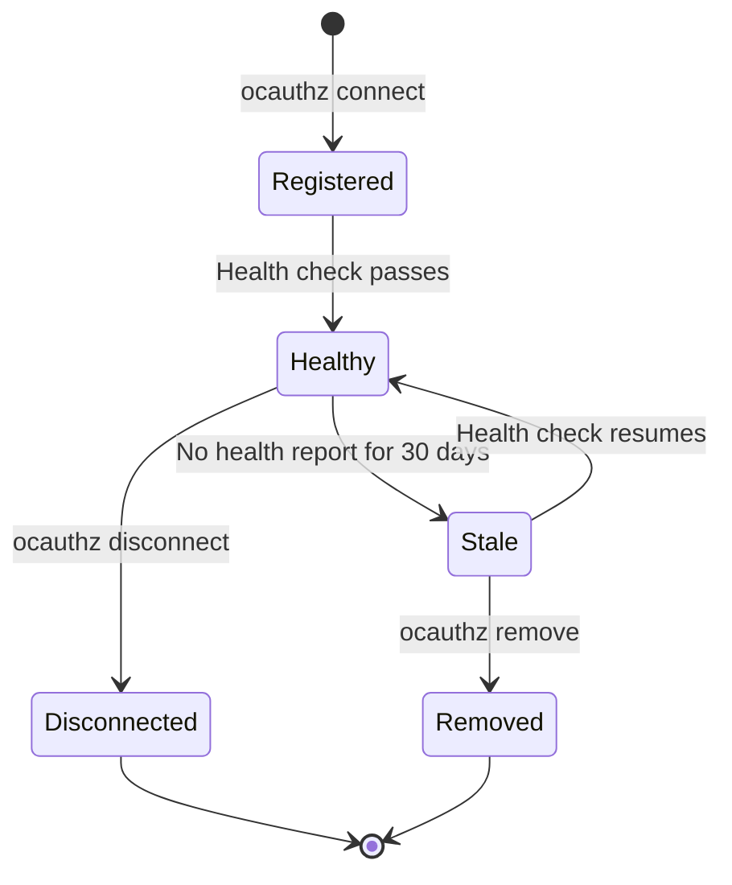

## Overview

An **agent** in Celerflow represents a single AI agent instance connected to your control plane. Each agent has a unique identity, belongs to a fleet, and reports health status at regular intervals.

## Agent lifecycle

## Agent states

| State | Description |
|---|---|
| **Registered** | Agent has connected but hasn't reported health yet. |
| **Healthy** | Agent is actively reporting health checks. |
| **Stale** | No health report received in 30+ days. |
| **Disconnected** | Agent was gracefully disconnected by the user. |
| **Removed** | Agent and its data have been permanently deleted. |

## Agent identity

Each agent is identified by:

- **Agent ID** — a unique UUID assigned on registration.
- **Agent name** — a human-readable name (defaults to hostname).
- **Bootstrap token** — a rotating secret used for authenticated API calls.

<Note>
  Bootstrap tokens rotate automatically. The CLI handles token rotation transparently. If you're integrating directly via API, call the [rotate token](/api-reference/auth/rotate-token) endpoint periodically.
</Note>

## Health reporting

Connected agents report health at configurable intervals. Each health check includes:

- Agent uptime
- Current status
- Timestamp

Health data powers the dashboard's real-time agent monitoring and alerting.

<Card title="Health checks" icon="heart-pulse" href="/concepts/health-checks" horizontal>
  Deep dive into health check configuration and monitoring.
</Card>
