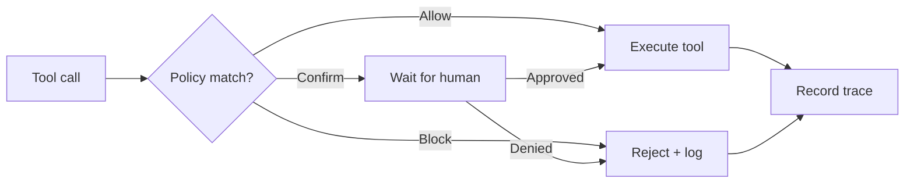

## Overview

Policies define **what tools an agent is allowed to use** and under what conditions. Every tool call passes through CelerFlow's policy engine before execution.

## Policy actions

| Action | Behavior |
|---|---|
| **Allow** | Tool call proceeds immediately. Trace is recorded. |
| **Block** | Tool call is rejected. Agent receives an error. Trace records the block. |
| **Confirm** | Tool call is paused until a human approves or denies it (HITL). |

## How policies are evaluated



## Policy rules

A policy rule consists of:

- **Tool name** — the MCP tool being called (e.g., `exec`, `write`, `gmail_send`).
- **Action** — allow, block, or confirm.
- **Conditions** (optional) — additional constraints like time windows or parameter patterns.

### Example policy

```json
{
  "rules": [
    { "tool": "exec", "action": "confirm" },
    { "tool": "read", "action": "allow" },
    { "tool": "gmail_send", "action": "block" },
    { "tool": "*", "action": "allow" }
  ]
}
```

Rules are evaluated **top to bottom**. The first matching rule wins. A wildcard (`*`) rule at the end serves as the default.

## Policy scope

Policies can be applied at different levels:

| Scope | Description |
|---|---|
| **Fleet** | Applies to all agents in the fleet. |
| **Agent** | Overrides fleet policy for a specific agent. |

Agent-level policies take precedence over fleet-level policies.

<Tip>
  Start with a permissive fleet policy and add restrictions as you learn which tools each agent actually uses. The traces dashboard shows you exactly which tools are being called.
</Tip>

## Human-in-the-loop (HITL)

When a tool call matches a `confirm` policy:

1. The tool call is paused.
2. A notification appears in the dashboard.
3. A team member reviews the tool name, parameters, and context.
4. They approve or deny the call.
5. The agent receives the result (or an error if denied).

<Note>
  HITL confirmations require the **Pro plan** or higher. On the Free plan, only `allow` and `block` actions are available.
</Note>
