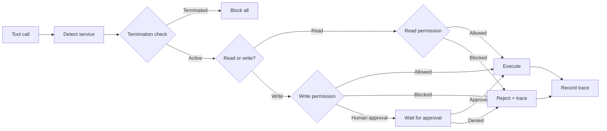

## Overview

CelerFlow manages permissions at the **service level**, not the individual tool level. A service is a logical group of related tools — for example, all `gmail_*` tools belong to the "Gmail" service.

Each service has two independent permission toggles:

| Permission | Options | Description |
|---|---|---|
| **Read** | Allowed · Blocked | Controls read-only operations (`gmail_read`, `gmail_search`...) |
| **Write** | Allowed · Blocked · Human approval | Controls write operations (`gmail_send`, `gmail_delete`...) |

## How it looks in the dashboard

```
Service Permissions — Agent: product-manager
┌─────────────────────────────────────────────────────┐
│                                                     │
│  📧 Gmail                    [Read ✅] [Write ⚠️]   │
│  Write requires human approval                      │
│                                                     │
│  📝 Notion                   [Read ✅] [Write ✅]   │
│                                                     │
│  📄 Google Docs              [Read ✅] [Write ❌]   │
│                                                     │
│  🖥️ System Tools             [Read ✅] [Write ⚠️]   │
│                                                     │
│  [+ Add Service]                                    │
└─────────────────────────────────────────────────────┘
```

- ✅ Allowed
- ❌ Blocked
- ⚠️ Human approval required

## Service mapping

CelerFlow detects services from MCP tool names using pattern matching:

| Service | Patterns |
|---|---|
| Gmail | `gmail_*` |
| Notion | `notion_*` |
| Slack | `slack_*` |
| GitHub | `gh_*`, `github_*` |
| Google Docs | `gdocs_*`, `google_docs_*` |
| Web | `web_*` |
| System Tools | `read`, `write`, `edit`, `exec`, `browser`, `memory_*` |

### Auto-discovery

When CelerFlow sees a tool call for a service it hasn't seen before, it automatically creates a policy entry with default permissions (read: allowed, write: allowed) and marks it as `auto_discovered`. You can then adjust permissions from the dashboard.

## Policy evaluation

When a tool call arrives:



<Tip>
  Start with permissive defaults and tighten as you learn what each agent actually needs. The tracing dashboard shows you exactly which services are being used.
</Tip>

## Scope

Permissions are set **per agent**. Each agent has its own set of service permission rules.

## Realtime sync

Permission changes are pushed to agents via **Supabase Realtime**. The OpenClaw plugin caches policies locally and updates them within seconds of a dashboard change. No restart needed.
