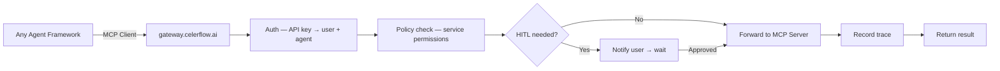

<Warning>
  **Coming Soon** — MCP Gateway is under active development. Beta currently supports **OpenClaw agents only** via the [OpenClaw plugin](/integration/openclaw-plugin). Check the [Roadmap](/platform/roadmap) for updates.
</Warning>

## Overview

The CelerFlow MCP Gateway is a standalone service that federates multiple MCP servers behind a single endpoint. Any agent framework with MCP client support can connect — no plugin installation needed.

## Architecture



The gateway is deployed on **Railway** as a stateless Node.js/TypeScript service. All state lives in Supabase, so the gateway scales horizontally.

## Setup

<Steps>
  <Step title="Create an API key">
    Go to **Settings → API Keys** in the dashboard. Create a key and copy it immediately — it's only shown once.
  </Step>

  <Step title="Register your MCP servers">
    In **Settings → MCP Servers**, register the backend MCP servers you want to expose through the gateway (e.g., Gmail MCP Server, Notion MCP Server).
  </Step>

  <Step title="Point your agent to the gateway">
    Replace your MCP server URLs with the single gateway endpoint:

    ```bash
    MCP_SERVER_URL=https://gateway.celerflow.ai/mcp
    # Authorization: Bearer cf_key_xxx
    ```

    The gateway federates all your registered MCP servers and handles tool discovery, policy checks, and tracing.
  </Step>
</Steps>

## Supported frameworks

| Framework | MCP support | Integration |
|---|---|---|
| **LangGraph** | ✅ Native MCP client | Point to `gateway.celerflow.ai` |
| **CrewAI** | ✅ `crewai-tools[mcp]` | Point to `gateway.celerflow.ai` |
| **Strands (AWS)** | ✅ Built on MCP | Point to `gateway.celerflow.ai` |
| **OpenAI Agents SDK** | ✅ MCP server support | Point to `gateway.celerflow.ai` |
| **Mastra** | ✅ Native MCP | Point to `gateway.celerflow.ai` |

## Framework examples

<Tabs>
  <Tab title="LangGraph">
    ```python
    mcp_config = {
        "server_url": "https://gateway.celerflow.ai/mcp",
        "headers": {"Authorization": "Bearer cf_..."}
    }
    ```
  </Tab>

  <Tab title="CrewAI">
    ```yaml
    mcp_server_url: "https://gateway.celerflow.ai/mcp"
    headers:
      Authorization: "Bearer cf_..."
    ```
  </Tab>

  <Tab title="OpenAI Agents SDK">
    ```python
    from openai import Agent

    agent = Agent(
        mcp_servers=[{
            "url": "https://gateway.celerflow.ai/mcp",
            "headers": {"Authorization": "Bearer cf_..."}
        }]
    )
    ```
  </Tab>
</Tabs>

## Gateway vs proxy

CelerFlow's MCP Gateway is not a simple proxy. It's a **federation layer**:

| Feature | Simple proxy | CelerFlow Gateway |
|---|---|---|
| Routes to | One upstream server | Multiple registered MCP servers |
| Tool discovery | Pass-through | Aggregated from all servers |
| Policy checks | ❌ | ✅ Service-level permissions |
| HITL | ❌ | ✅ Human approval flow |
| Tracing | ❌ | ✅ Full trace recording |
| Protocol | Varies | **Streamable HTTP** (MCP 2025-03 standard) |

## Limitations

- Only captures **MCP protocol** tool calls. Built-in tools (e.g., Claude Code's `file_edit`) are not intercepted.
- HITL confirmations work but require an approval channel (see [Human approval](/concepts/human-approval)).
- Token usage data requires the agent framework to report it via metadata headers (optional).

## Rate limits

| Plan | Requests/min |
|---|---|
| Pro | 100 |
| Team | 500 |
| Enterprise | 2,000 |

## Latency

The gateway adds **< 50ms P99** overhead. Policy checks use an in-memory cache (60s TTL), and trace writes are non-blocking.
