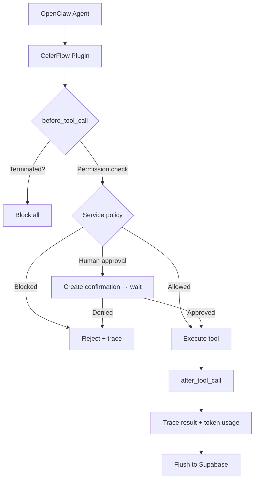

## Overview

The CelerFlow plugin for OpenClaw (`celerflow` npm package) integrates directly into the agent runtime. It uses `before_tool_call` and `after_tool_call` hooks to intercept every tool call — built-in tools (read, write, exec, browser) and MCP tools alike.

## Architecture



## What the plugin does

| Hook | Actions |
|---|---|
| `before_tool_call` | Check termination status → check service permission → HITL if needed → record intent trace |
| `after_tool_call` | Record result trace with status, duration, summary → buffer token usage |

## Plugin internals

| Component | Purpose |
|---|---|
| **Policy cache** | Caches service permissions locally. Updated in real time via Supabase Realtime subscriptions. |
| **Trace buffer** | Batches trace spans and flushes to Supabase every few seconds to reduce API calls. |
| **Health check** | Reports agent health at the configured interval. |
| **Confirmation** | Handles HITL flow — creates a confirmation request, polls for response, blocks until resolved. |
| **Config watcher** | Watches `openclaw.plugin.json` for configuration changes. |
| **Sanitizer** | Strips secrets and truncates parameters before recording traces. |
| **Summary generator** | Creates one-line summaries for each tool call. |

## Configuration

The plugin reads from `openclaw.plugin.json` in your agent's workspace (`~/.openclaw/<agent-name>/`):

```json
{
  "agent_id": "your-agent-uuid",
  "bootstrap_token": "bt_xxx",
  "saas_url": "https://api.celerflow.ai"
}
```

<Tip>
  You **never** need to create this file manually. `celerflow connect` discovers your agents, registers them, and writes this config automatically.
</Tip>

The plugin uses `watchForConfig()` to monitor for this file. If the file doesn't exist when the agent starts, the plugin waits until `celerflow connect` creates it, then auto-activates.

## Sync service

Once activated, the plugin runs a background sync service:

| Task | Interval | What it does |
|---|---|---|
| **Trace flush** | Every 300 seconds | Batches pending traces and sends to CelerFlow |
| **Health check** | Every 15 minutes | Reports agent health status (latency, uptime) |
| **Token flush** | Every 300 seconds | Sends accumulated token usage (input/output/cache) |
| **Policy sync** | Real-time | Listens to Supabase Realtime for permission changes |

## What it covers vs MCP Gateway

| Capability | Plugin | MCP Gateway |
|---|---|---|
| Built-in tools (read, write, exec, browser) | ✅ | ❌ |
| MCP tools | ✅ | ✅ |
| Token usage tracking | ✅ | ⚠️ Needs agent to report |
| Termination (kill switch) | ✅ Instant (local cache) | ⚠️ Only blocks MCP calls |
| Agent score (full data) | ✅ | ⚠️ Limited data |
| Config export | ✅ | ❌ |
| Latency overhead | Zero | ~10–50ms |
